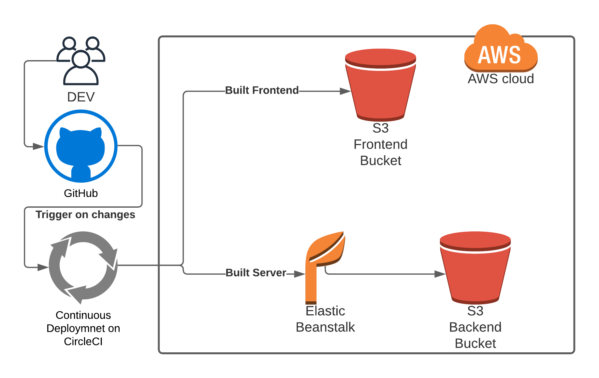

# Hosting a Full-Stack Application

### **You can use you own project completed in previous courses or use the provided Udagram app for completing this final project.**

---

In this project you will learn how to take a newly developed Full-Stack application built for a retailer and deploy it to a cloud service provider so that it is available to customers. You will use the aws console to start and configure the services the application needs such as a database to store product information and a web server allowing the site to be discovered by potential customers. You will modify your package.json scripts and replace hard coded secrets with environment variables in your code.

# Access Websit
You can access the website from the following link:
http://myrandombucket124312412.s3-website-us-east-1.amazonaws.com/

# Hosting

The service is hosted on AWS using Elastic Beanstalk for the Backend API including a postgres relational database and a S3 Bucket for the frontend.

### RDS Postgres
The application uses an AWS RDS Postgres database.

URL: apidb2.crrocpk4jrme.us-east-1.rds.amazonaws.com

### Elastic Beanstalk
The sever application is deployed on AWS Elastic Beanstalk by uploading an archived build to an AWS S3 bucket. Elastic Beanstalk the extracts and runs the application on the endpoint.

URL: http://apienv.us-east-1.elasticbeanstalk.com/

### S3 Bucket for Frontend
The frontend application is deployed on to an AWS S3 bucket. 

URL: http://myrandombucket124312412.s3-website-us-east-1.amazonaws.com
Port: 5432

# CI / CD Pipeline
CircleCi is used to automise the deployment process. It connects to the Github project and is set up to be executed automatically when code is pushed on the main Github branch.

